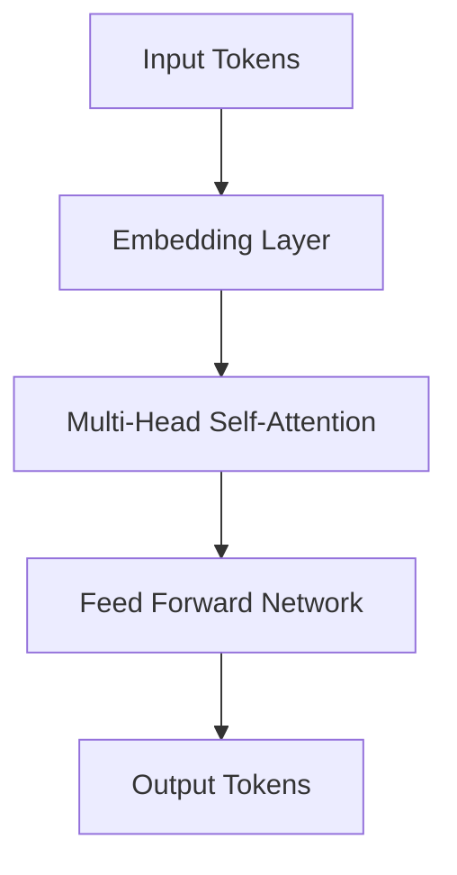

# 🤖 AI Autonomous Agents  
### From LLMs to Model Context Protocols and Real-World Systems  
**Speaker:** Willy RODRIGUEZ
**Organization:** Toulouse Data Science
**Duration:** ~45 minutes

---

## 🧭 Motivation

- LLMs are no longer just chatbots — they can **plan, act, and learn**.  
- We are witnessing the shift from *assistants* → *autonomous agents*.  
- Agents can:  
  - Use tools  
  - Access external data  
  - Make decisions autonomously  

🧩 **Goal of this talk:**  
Understand *how* this autonomy works and see *what’s possible* today.

---

## Outline

1. Large Language Models — quick refresher  
2. Architectures for agentic systems  
3. The Model Context Protocol (MCP)  
4. Real-world demos and open-source stack  
5. Discussion & future directions

---

## 1️⃣ What Are Large Language Models?

- Based on the **Transformer** architecture (Vaswani et al., 2017)  
- Trained on massive text corpora → emergent reasoning abilities  
- Key properties:  
  - In-context learning  
  - Chain-of-thought reasoning  
  - Function calling / tool use  

📈 *Scaling laws → more data + compute → emergent behavior*

---

## ⚙️ Quick Recap: Transformer Architecture

**Core idea:** Attention mechanism learns contextual dependencies  
- Self-Attention: \( \text{Attention}(Q, K, V) = \text{softmax}\left(\frac{QK^T}{\sqrt{d_k}}\right)V \)  
- Enables parallelism & long-range dependencies  

🧠 *Result: a model that can encode meaning across long sequences.*



---

## 🌍 LLM Landscape (2025)

| Category	| Models | Notes
------|-----|-----| 
Proprietary	| GPT-4o, Claude 3, Gemini 1.5	| Multimodal, highly optimized
Open Source | Llama-3, Mistral, Mixtral, Falcon, Yi | Customizable and efficient
Agent Frameworks | LangChain, CrewAI, AutoGen, OpenDevin | Enable reasoning + action


📊 *Open models now rival closed ones in many benchmarks.*


---

## From LLMs to Agents

LLMs ≠ Agents

| LLM	| Agent | 
------|-----| 
Predicts next token	| Executes tasks
Static context | Dynamic memory
No persistence | Has tools & goals


**Agent loop:** → Plan → Act → Observe → Reflect → Repeat

```
A[Plan] --> B[Act]
B --> C[Observe]
C --> D[Reflect]
D --> A
```
---

## 🧩 Core Components of an Agent

* Planner / Controller — LLM orchestrates reasoning
* Tools / APIs — perform external actions (search, code exec, etc.)
* Memory —
  * Short-term: context window
  * Long-term: vector store / RAG
* Environment — user interface, web, or local system

```graph TD
A[User] --> B[Agent Controller]
B --> C[LLM Reasoning Core]
B --> D[Memory Store]
B --> E[Tool / API Interfaces]
C --> F[Action Output]
```

---

## 🧠 Example: ReAct Framework (Yao et al., 2022)

Agents interleave reasoning traces with actions.

Example trace:

```vbnet
Thought: I need the current weather.
Action: call(weather_api, "Toulouse")
Observation: 21°C, sunny
Thought: I'll tell the user it's sunny.
Answer: It's 21°C and sunny in Toulouse.
```

---

## 🛰️ Model Context Protocol (MCP)
A new standard for connecting models to tools

Goal: Let models interact with external systems via a standardized interface

Adopted by: Anthropic (Claude), OpenAI, and open implementations

Defines:

* Servers = tools, resources, schemas
* Clients = LLM runtime interfaces
* Models = consume structured responses

```graph LR
A[LLM] <--> B[MCP Client]
B <--> C[MCP Server]
C --> D[(APIs / Databases / Files)]
```

---

## 🧱 MCP Architecture

Step-by-step interaction

1. Model sends request (list_resources, invoke_tool, etc.)
2. MCP server executes function & returns structured JSON
3. Model integrates results into reasoning context

Example schema:
```json
{
  "name": "get_weather",
  "parameters": { "city": "Toulouse" },
  "returns": { "temp": "float", "condition": "string" }
}
```
---

## ⚖️ MCP vs Other Architectures


Feature | Function Calling | LangChain | MCP
---|---|---|---
Vendor neutral | ❌ | ❌ | ✅
Schema registry | ⚠️ | ✅ | ✅
Model-driven control | ✅ | ✅ | ✅
Plug-and-play tools | ❌ | ⚠️ | ✅

---

## 📡 MCP aims to be the “HTTP of agent tool use.”

3️⃣ Real-World Examples
Proprietary Ecosystems

Claude 3 + MCP: direct server integration (file systems, APIs)

Gemini 1.5: multi-modal reasoning + contextual memory

GPT-4o: real-time voice + visual tool use

(Short video clip or screenshots)

---

🧪 Open-Source Demo Idea
“Autonomous Research Assistant”

Stack:

Model: Llama-3 8B (via Ollama or LM Studio)

Framework: LangGraph or CrewAI

Tools: Arxiv API (via MCP server) + local RAG memory

Goal: Summarize papers about “Topic Modeling” autonomously

```graph LR
A[Llama-3 Agent] --> B[MCP Server]
B --> C[Arxiv API]
B --> D[(Vector DB)]
```

---

## Demo Flow

1. User asks: “Find 3 recent papers on diffusion transformers.”
2. Agent:
  * Searches Arxiv
  * Summarizes abstracts
  * Ranks results
  * Produces a final report
3. Output displayed in terminal or web UI

🧠 Shows reasoning → action → synthesis loop.

---

## Alternative Demo: Voice Agent (Fully Open)

Stack:
* Whisper (speech-to-text)
* Llama-3 (reasoning)
* Piper or Coqui TTS (speech synthesis)
* MCP for tasks (weather, notes, etc.)

🎙️ “Hey assistant, summarize today’s AI news.”
→ Spoken answer generated locally!

--- 

## 🧭 Challenges Ahead

* Reliability & hallucination control

* Memory consistency & long-term goals

* Security & sandboxing for tool execution

* Evaluation metrics for autonomy

---

## 🔮 Future Directions

* Multi-agent collaboration (CrewAI, AutoGen)

* Embodied agents (robotics integration)

* Fine-tuned tool-use (Toolformer-style)

* AI Operating Systems (MCP-based infrastructure)

📈 Agents as the next layer of abstraction — like containers for cognition.

---

## 🧩 Key Takeaways

* LLMs are reasoning engines

* Agents give them tools, memory, and goals

* MCP enables standardized, safe interoperability

* Open-source tools now make fully local agents possible

---

## 📚 Suggested Reading

* Yao et al., ReAct: Reasoning and Acting in Language Models (2022)

* Schick et al., Toolformer (2023)

* Anthropic, Model Context Protocol Specification (2024)

* LangChain / LangGraph Docs

* CrewAI / AutoGen Projects

---

### 🙏 Thank You

💡 “LLMs gave us reasoning. MCP gives them agency.”
Questions?

