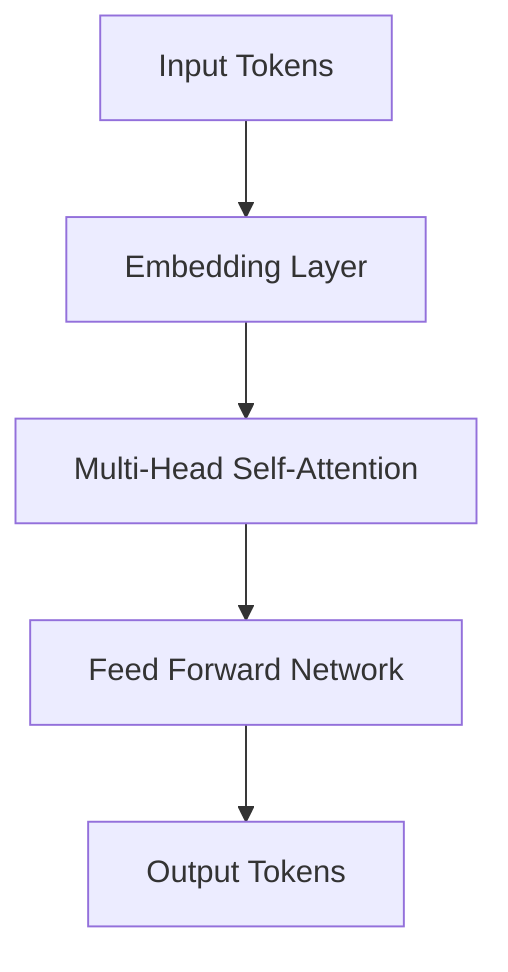

# 🤖 AI Autonomous Agents  
### From LLMs to Model Context Protocols and Real-World Systems  
**Speaker:** Willy RODRIGUEZ
**Organization:** Toulouse Data Science
**Duration:** ~45 minutes

---

## 🧭 Motivation

- LLMs are no longer just chatbots — they can **plan, act, and learn**.  
- We are witnessing the shift from *assistants* → *autonomous agents*.  
- Agents can:  
  - Use tools  
  - Access external data  
  - Make decisions autonomously  

🧩 **Goal of this talk:**  
Understand *how* this autonomy works and see *what’s possible* today.

---

## Outline

1. Large Language Models — quick refresher  
2. Architectures for agentic systems  
3. The Model Context Protocol (MCP)  
4. Real-world demos and open-source stack  
5. Discussion & future directions

---

## 1️⃣ What Are Large Language Models?

- Based on the **Transformer** architecture (Vaswani et al., 2017)  
- Trained on massive text corpora → emergent reasoning abilities  
- Key properties:  
  - In-context learning  
  - Chain-of-thought reasoning  
  - Function calling / tool use  

📈 *Scaling laws → more data + compute → emergent behavior*

---

## ⚙️ Quick Recap: Transformer Architecture

**Core idea:** Attention mechanism learns contextual dependencies  
- Self-Attention: \( \text{Attention}(Q, K, V) = \text{softmax}\left(\frac{QK^T}{\sqrt{d_k}}\right)V \)  
- Enables parallelism & long-range dependencies  

🧠 *Result: a model that can encode meaning across long sequences.*

---

## 🌍 LLM Landscape (2025)

| Category	| Models | Notes
------|-----|-----| 
Proprietary	| GPT-4o, Claude 3, Gemini 1.5	| Multimodal, highly optimized
Open Source | Llama-3, Mistral, Mixtral, Falcon, Yi | Customizable and efficient
Agent Frameworks | LangChain, CrewAI, AutoGen, OpenDevin | Enable reasoning + action

📊 *Open models now rival closed ones in many benchmarks.*

