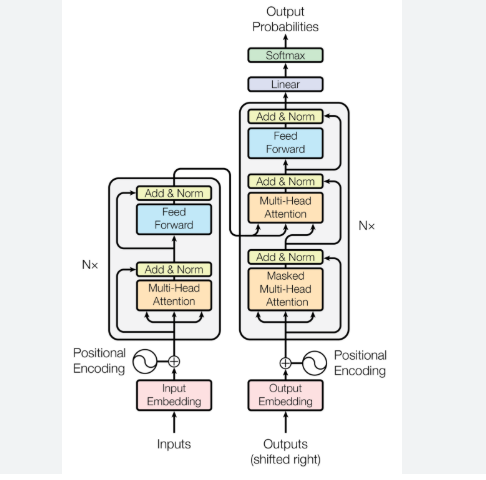
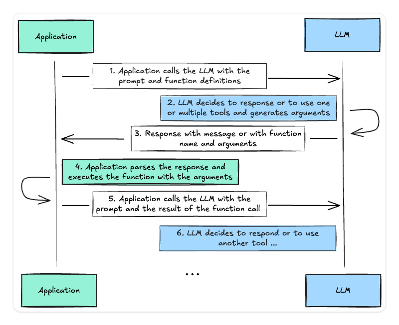
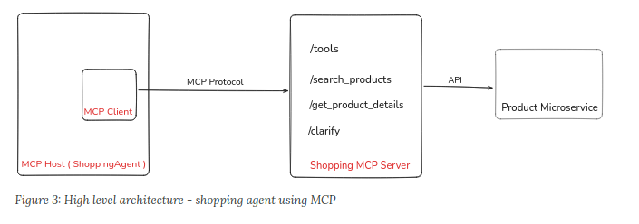

<!-- _class: lead -->
# 🤖 Agents Autonomes IA
## Des LLMs aux Protocoles MCP et aux Systèmes Opérationnels

**Intervenant :** Willy RODRIGUEZ  
**Organisation :** Toulouse Data Science  
**Durée :** ~45 minutes (plus ou moins)

---

# Motivation

- Les LLMs ne sont plus seulement des chatbots — ils peuvent planifier, agir et apprendre.
- Nous assistons à la transition des assistants vers de véritables agents autonomes.
- Les agents peuvent :
  - Utiliser des outils
  - Accéder à des données externes
  - Prendre des décisions de manière autonome

**Objectif :**  
Comprendre comment fonctionne cette autonomie et ce qui est possible aujourd'hui.

---

# Plan de la présentation

1. Rappel rapide sur les LLMs
2. Architectures des systèmes agentiques
3. Le Model Context Protocol (MCP)
4. Démos réelles + stack open-source
5. Discussion & perspectives

---

# Qu'est-ce qu'un Large Language Model (LLM) ?

- Basé sur l'architecture Transformer (Vaswani et al., 2017)
- Entraîné sur d'immenses corpus → capacités de raisonnement émergentes
- Caractéristiques clés :
  - Apprentissage in-context
  - Raisonnement chaîne-de-pensées
  - Function calling / outils

**Plus de données + plus de calcul → comportements émergents.**

---

# Rappel : Architecture Transformer

**Idée centrale :** le mécanisme d'attention capture les dépendances contextuelles

- Self-Attention : $\text{softmax}\left(\frac{QK^T}{\sqrt{d_k}}\right) V$
- Permet le parallélisme et les dépendances longues

**Résultat :** un modèle capable d'encoder du sens sur de longues séquences.

---
# Transformer


---

# Écosystème LLM (2025)

**Propriétaires :**
- GPT-5, GPT-4o, Claude 4 Opus, Claude 3.5 Sonnet
- Gemini 2.5 Pro, Gemini 3, Grok 4

**Open source :**
- Llama 4, Llama 3, Mistral 8x22B, Qwen3
- DeepSeek R1, DeepSeek-V3, Gemma 3

**Frameworks d'agents :**
- LangChain, CrewAI, AutoGen, OpenDevin

Les modèles open rivalisent désormais avec les modèles propriétaires.

---

# Des LLMs aux Agents

## LLM ≠ Agent

**LLM :**
- Prédit le prochain token
- Contexte statique
- Pas de persistance

**Agent :**
- Exécute des tâches
- Mémoire dynamique
- Dispose d'outils & d'objectifs

**Boucle agent :** Planifier → Agir → Observer → Réfléchir → Répéter

---



---

# Composants essentiels d'un agent

- **Planificateur / Contrôleur** — le LLM orchestre le raisonnement
- **Outils / APIs** — actions externes (recherche, exécution de code…)
- **Mémoire :**
  - Court terme : fenêtre de contexte
  - Long terme : base vectorielle / RAG
- **Environnement :** interface utilisateur, web, système local

---

# Exemple : ReAct (Yao et al., 2022)

Les agents alternent raisonnement et actions.

**Exemple :**

```
Thought : J'ai besoin de la météo actuelle.
Action : call(weather_api, "Toulouse")
Observation : 21°C, ensoleillé
Thought : Je vais transmettre cette info.
Response : Il fait 21°C et ensoleillé à Toulouse.
```

---

# Model Context Protocol (MCP)

Un nouveau standard pour connecter les modèles aux outils.

**Objectif :** permettre aux modèles d'interagir avec des systèmes externes via une interface standardisée.

Adopté par Anthropic, OpenAI et la communauté open-source.

**Définit :**
- Serveurs = outils, ressources, schémas
- Clients = environnements d'exécution des LLMs
- Modèles = consomment des réponses structurées

---



---

# Architecture MCP

**Étapes :**

1. Le modèle envoie une requête (list_resources, invoke_tool…)
2. Le serveur MCP exécute et renvoie du JSON structuré
3. Le modèle intègre la réponse dans son raisonnement

**Exemple :**
```json
{
  "name": "get_weather",
  "parameters": { "city": "Toulouse" },
  "returns": { "temp": "float", "condition": "string" }
}
```

---

# MCP : le "HTTP de l'usage d'outils par les agents"

**Exemples propriétaires :**
- Claude 3 + MCP : systèmes de fichiers, API
- Gemini 1.5 : raisonnement multimodal + mémoire
- GPT-4o : voix en temps réel + outils visuels

---

# Démo open-source : "Assistant de recherche autonome"

**Stack :**
- Llama-3 8B (Ollama / LM Studio)
- LangGraph ou CrewAI
- Arxiv API via MCP + mémoire RAG locale

**Objectif :** résumer des articles sur le Topic Modeling

---

# Déroulement de la démo

1. L'utilisateur demande : *"Trouve 3 articles récents sur les diffusion transformers."*
2. L'agent :
   - Interroge Arxiv
   - Résume les abstracts
   - Classe les résultats
   - Produit un rapport
3. Résultat affiché en terminal ou web

---

# Autre démo : Agent vocal (100% open source)

**Stack :**
- Whisper (STT)
- Llama-3 (raisonnement)
- Piper / Coqui (TTS)
- MCP pour les tâches

**Exemple :**
*"Assistant, résume les actualités IA du jour."*  
→ Réponse parlée générée localement.

---

# Défis

- Fiabilité & réduction des hallucinations
- Cohérence de la mémoire & objectifs long terme
- Sécurité & sandboxing
- Métriques d'évaluation de l'autonomie

---

# Utilisations avancées des agents

Approches sophistiquées pour déployer des agents autonomes :

- **Collaboration multi-agents** — plusieurs agents travaillent ensemble
- **Agents incarnés** — intégration robotique et physique
- **Outils fine-tuned** — modèles spécialisés pour l'utilisation d'outils (Toolformer)
- **OS d'Agents** — infrastructure dédiée basée sur MCP

**Les agents deviennent une nouvelle couche d'abstraction — un "container" pour la cognition.**

---

# À retenir

- Les LLMs sont des moteurs de raisonnement
- Les agents leur donnent des outils, de la mémoire et des objectifs
- MCP standardise une interopérabilité sûre
- L'open-source permet des agents locaux et autonomes

---

# Quelques Références

- ReAct (Yao et al., 2022)
- Toolformer (Schick et al., 2023)
- Model Context Protocol Spec (2024)
- LangChain / LangGraph
- CrewAI / AutoGen

---

<!-- _class: lead -->
# 🙏 Merci !

*"Les LLMs fournissent les capacités d'inférence et de raisonnement symbolique. MCP standardise l'agentivité via une interface d'interaction avec des systèmes externes."*

**Questions ?**

